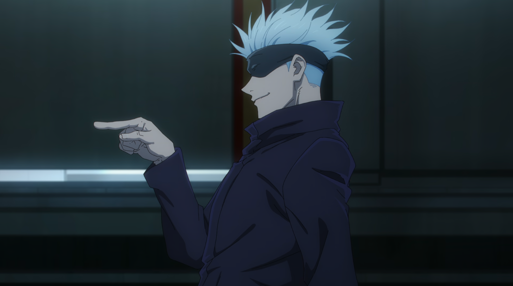
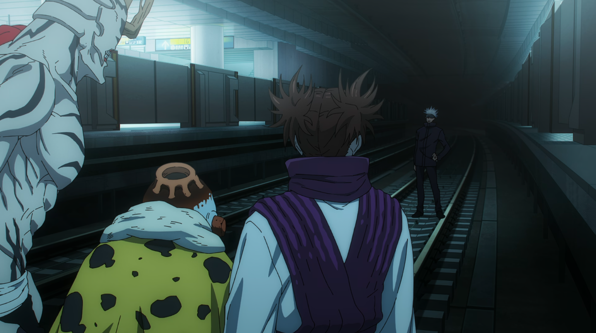
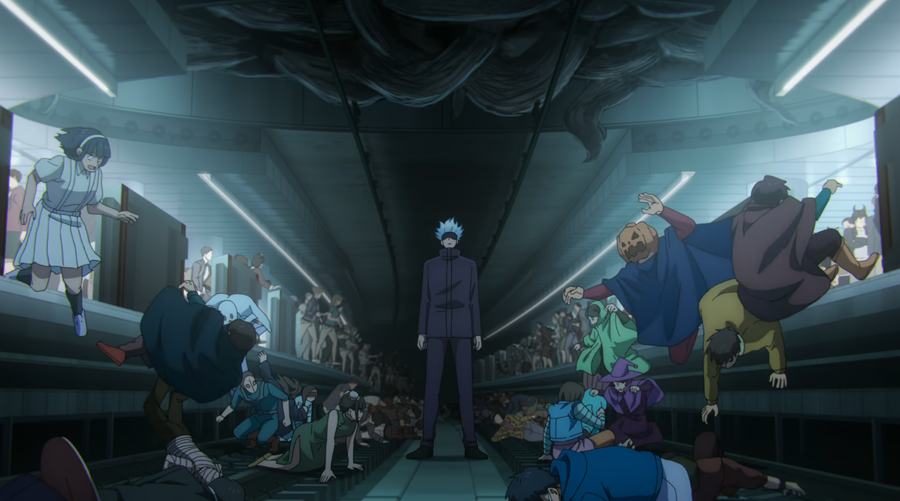
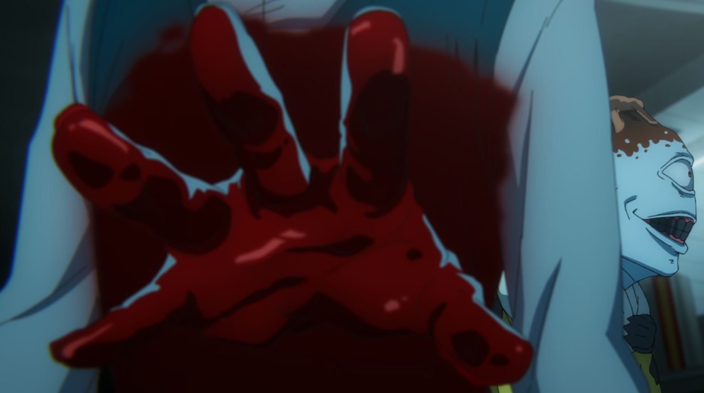
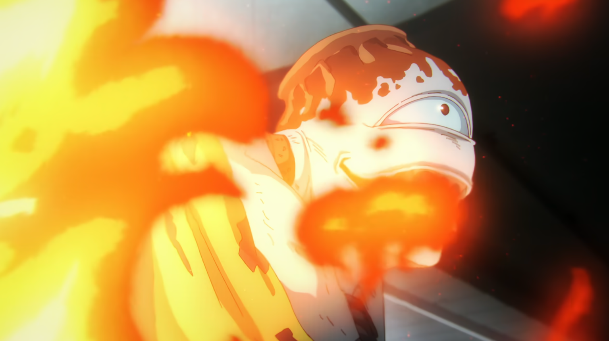
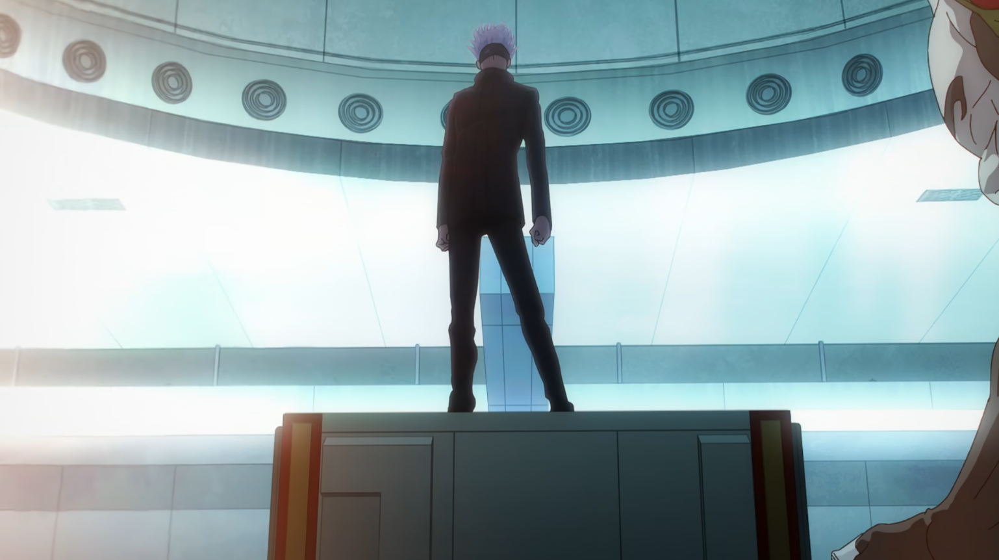
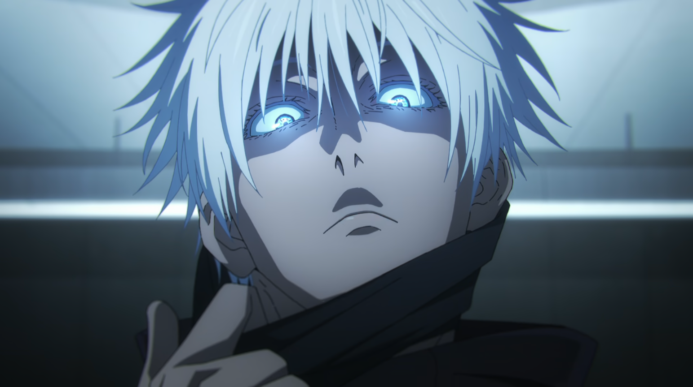
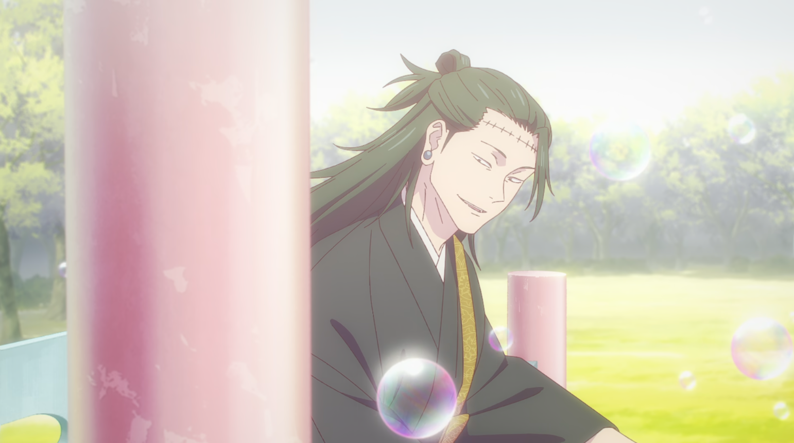

## アニメ32話“渋谷事変 [🏠](../README.md#top)

### ④ 19:48 メトロ渋谷駅副都心線B5Fホーム
アニメを今すぐにふり返れる方はぜひ見てほしいこのシーン、穴までちゃんとアニメで描いてありました✨

さっきヒカリエ前の空洞から降下してきたので、この場所ですね。

副都心線の8号車部分にこちらの空洞部分がありました！

「準備ばっちりってわけだ」

「来たな」

「これで負けたら言い訳できないよ」

16:43「そんな事しなくたっても逃げないよ」  
16:44「僕が逃げたらお前らここの人間全員殺すだろ」

「逃げたら、か…」  
「回答は」  
「逃げずともだ！！」

「こうでもせんとわからんか？」  

「正直驚いたよ」  
「なんだ？言い訳か？」  

「違ぇよハゲ」  

「この程度で僕に勝てると思ってる脳みそに驚いたって言ってんだよ」  

「最低でも20分はほしい」  
「そのあとは…私と”獄門疆”の出番だ」

[▲TOPへ](../README.md#top)
