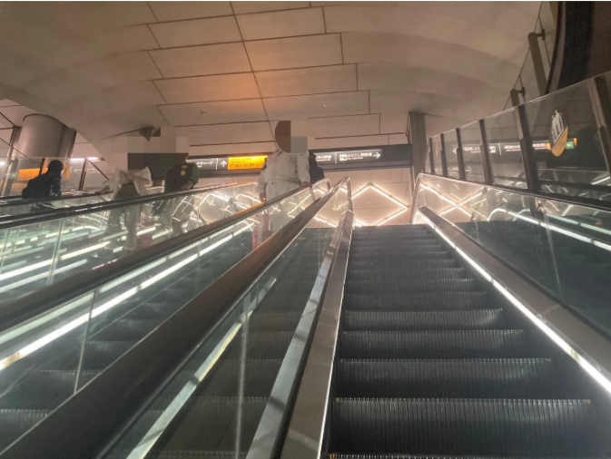

## アニメ36話“鈍刀” [🏠](../README.md#top)

00:41の七海が伊地知を助けに来るシーンは、前述 [⑦](s34_7.md) の場所と同様なのでこちらでは省略します。

### ⑰ 21:43 ヒカリエ改札内エスカレーター
虎杖が滑り降りるエスカレーター。  
天井の柄も全く一緒でテンション上がります。

ですがこのエスカレーター、かなり人通りが多く写真をきれいにアニメのような画角で撮影することは難しいかもしれません。

エスカレーターを降りると脹相戦の聖地に直結です！

[▲TOPへ](../README.md#top)
