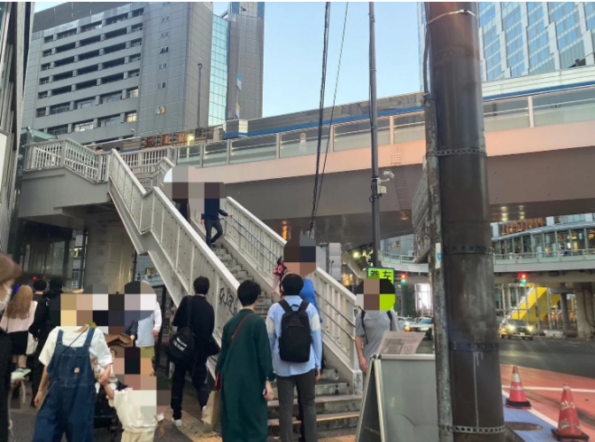
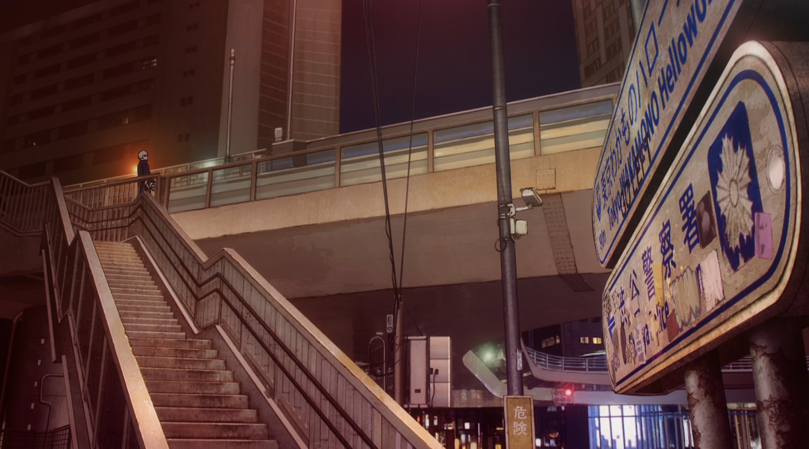
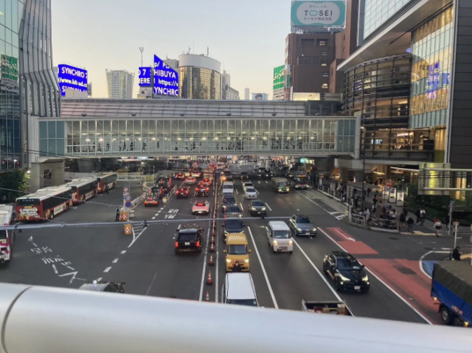
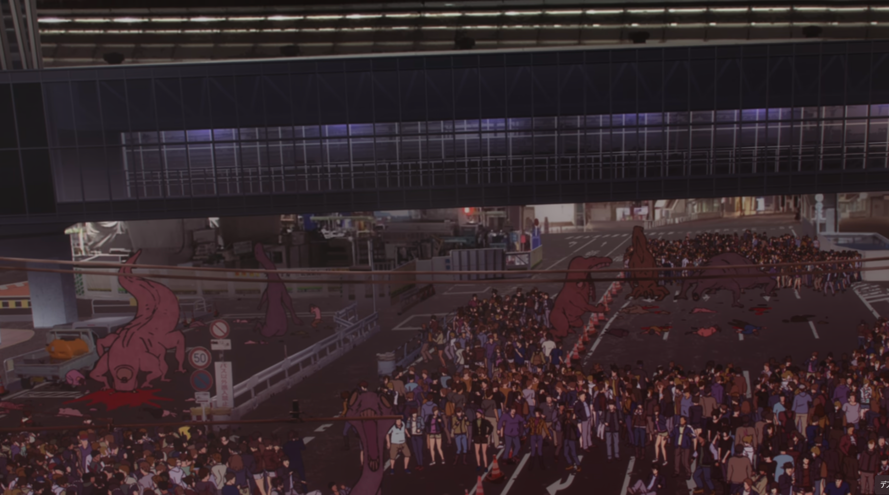
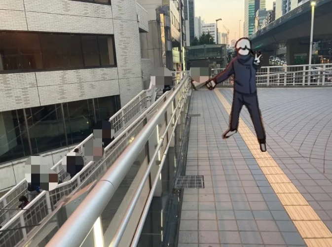
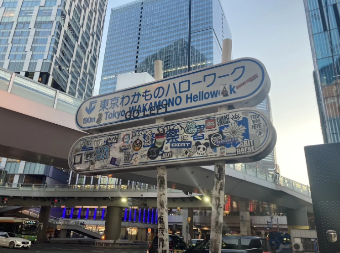
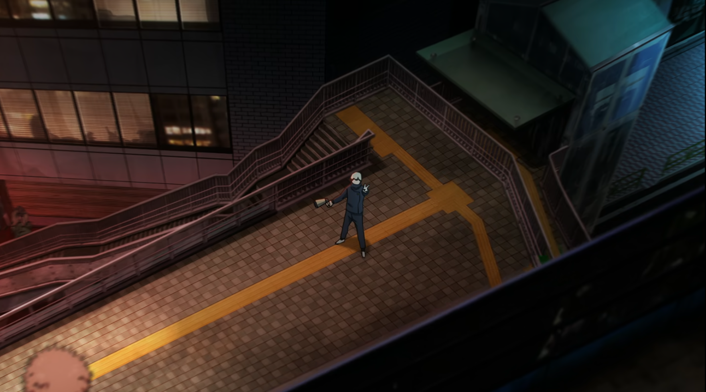
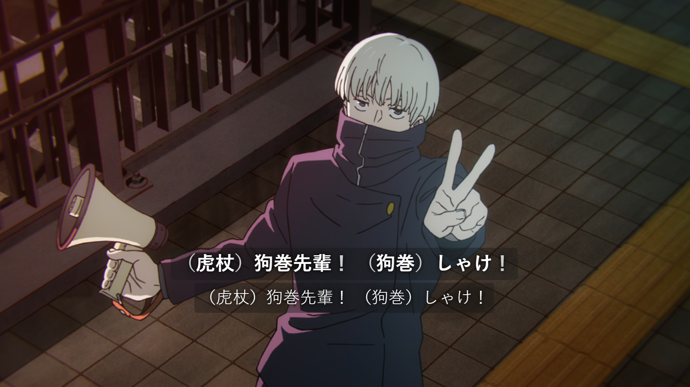
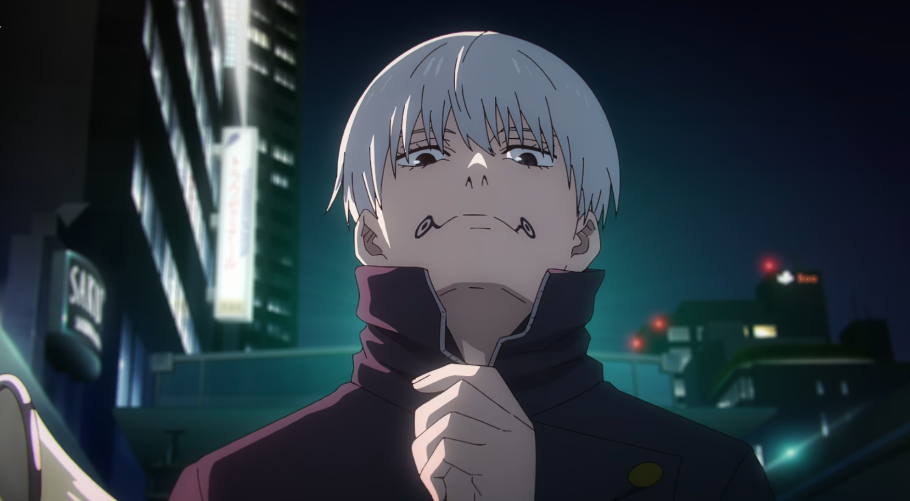

 [🏠](../README.md#top)

## アニメ37話“赤鱗”
脹相戦の聖地は上記の通りなので省略します。

### ⑲ 00:56 西口歩道橋

困っている虎杖のもとに狗巻先輩が駆けつけてくれる頼もしいシーン✨

虎杖は高速道路の上から見ているので若干視点が異なりますが、『駅は、五条先生はもうすぐそこだっていうのに！』の時の景色とほぼ同じものを歩道橋の上から見ることができます！

「ほっとくわけにはいかねえ」
「駅は…五条先生は」
「もうすぐそこだっていうのに！」

虎杖が思いっきりジャンプの踏み台にしていた標識も階段下にそのまんまあります。

00:54 「頼んます！」「しゃけしゃけ」

[▲TOPへ](../README.md#top)

### ⑳ 10:34 ヒカリエ改札内トイレ
36話の聖地として紹介したヒカリエ改札内の空間の、エスカレーターを降りて右手にあるトイレがあの激闘があった場所。

あんな緊迫感のある戦いが繰り広げられたなんてドキドキします。

「バカが そこにあるのはトイレとエレベーターのみ」

[▲TOPへ](../README.md#top)
