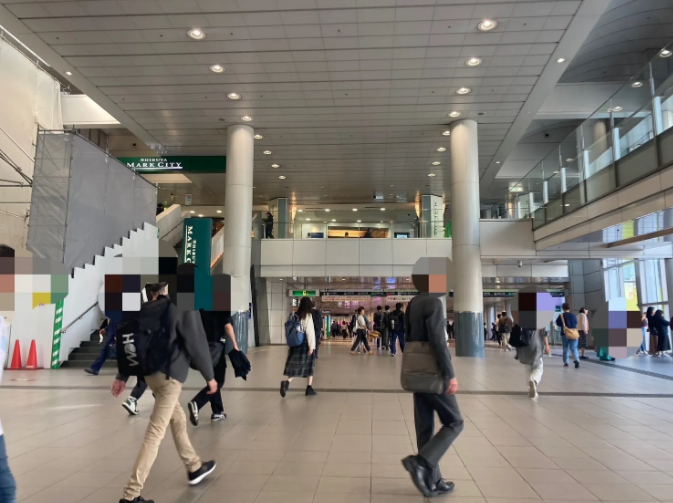
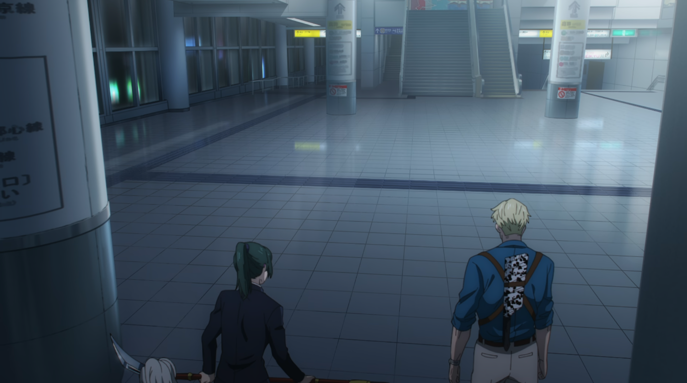
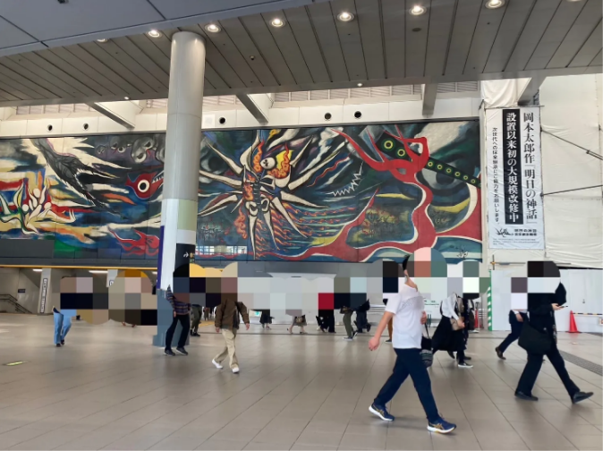
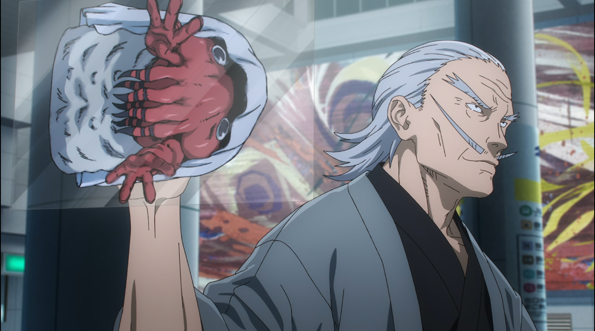
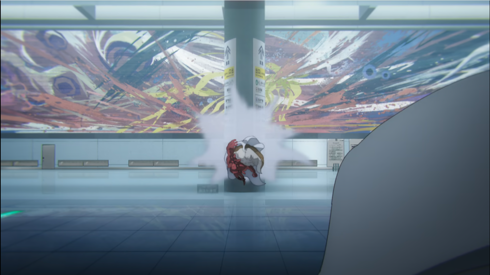
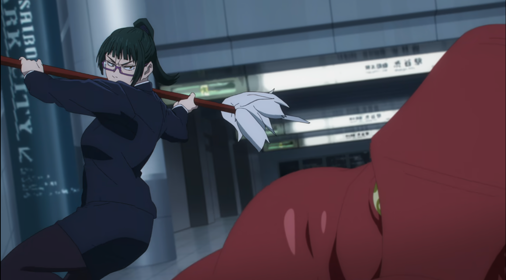
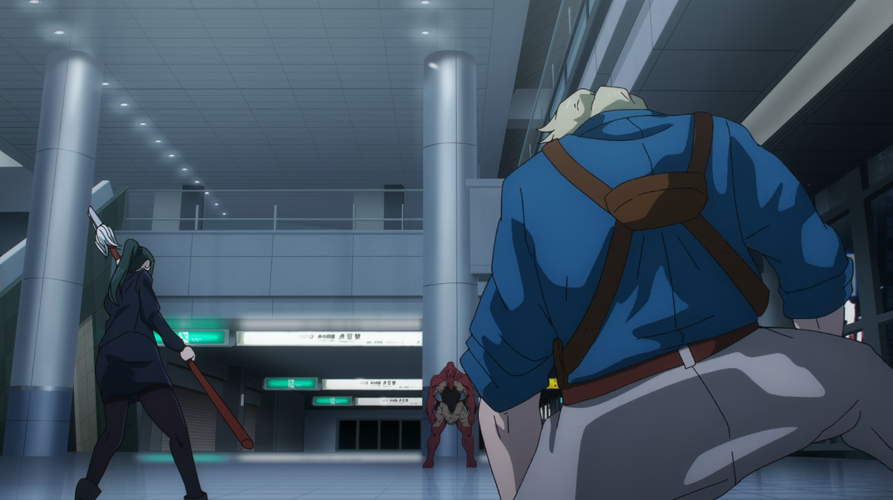
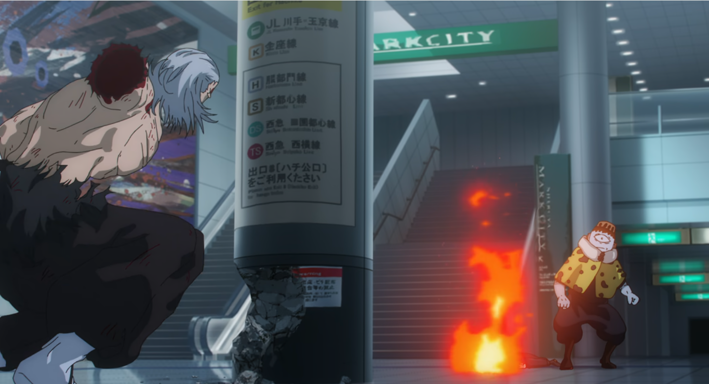

 [🏠](../README.md#top)

## アニメ38話“揺蕩”

### ㉑ 07:43 井の頭線　渋谷駅　アベニュー口

七海と真希、直毘人という珍しいチームが登場する最初のシーン。

この後井の頭線とマークシティをつなぐ岡本太郎の絵のある広場に移動します。

[▲TOPへ](../README.md#top)

### ㉒ 08:06 マークシティ内連絡通路

陀艮戦が繰り広げられる場所。

かなり広々としていて、人通りは多め。

ガラス窓からはスクランブル交差点も一望できます。

[▲TOPへ](../README.md#top)
