

## アニメ38話“揺蕩” [🏠](../README.md#top)

### ㉒ 08:06 マークシティ内連絡通路

陀艮戦が繰り広げられる場所。

かなり広々としていて、人通りは多め。

ガラス窓からはスクランブル交差点も一望できます。

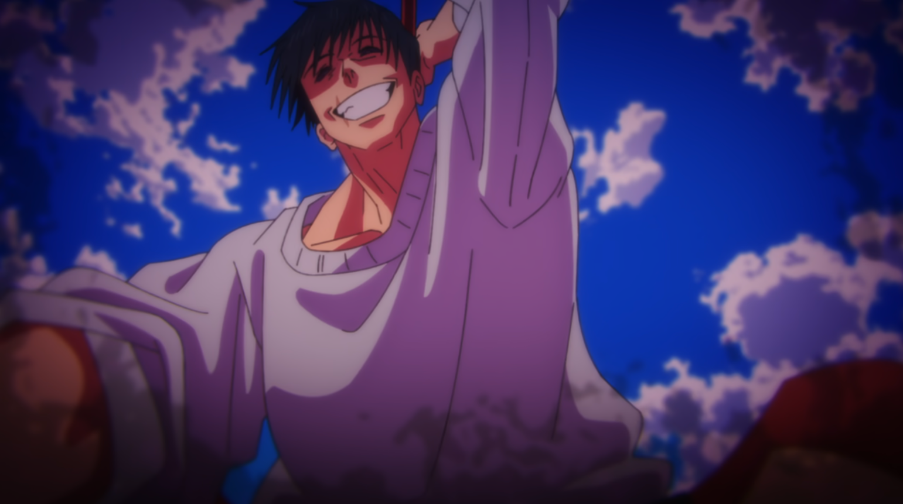

陀艮(だごん)撃破

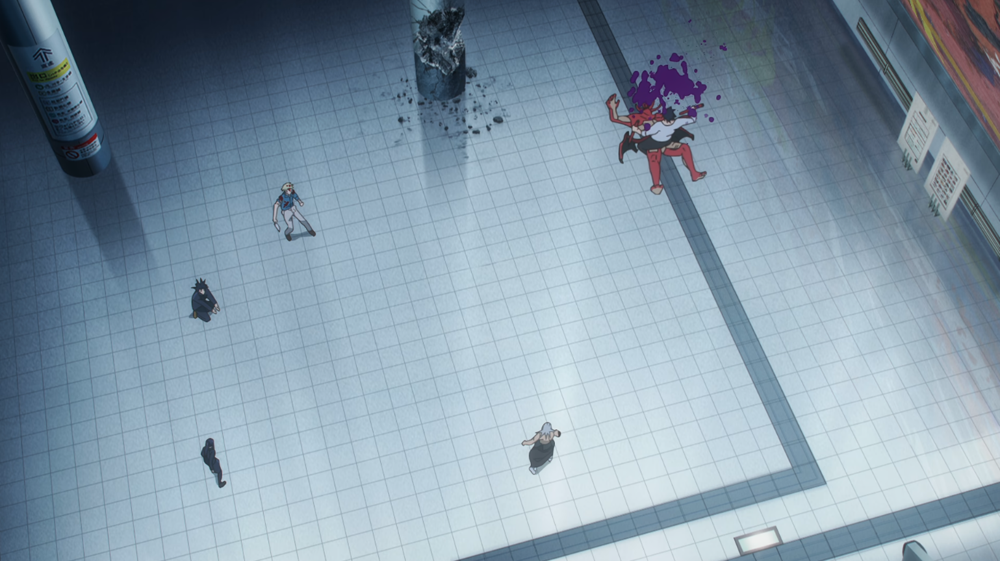
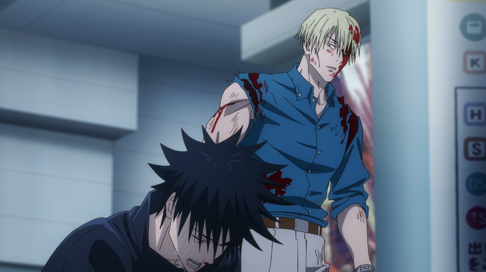
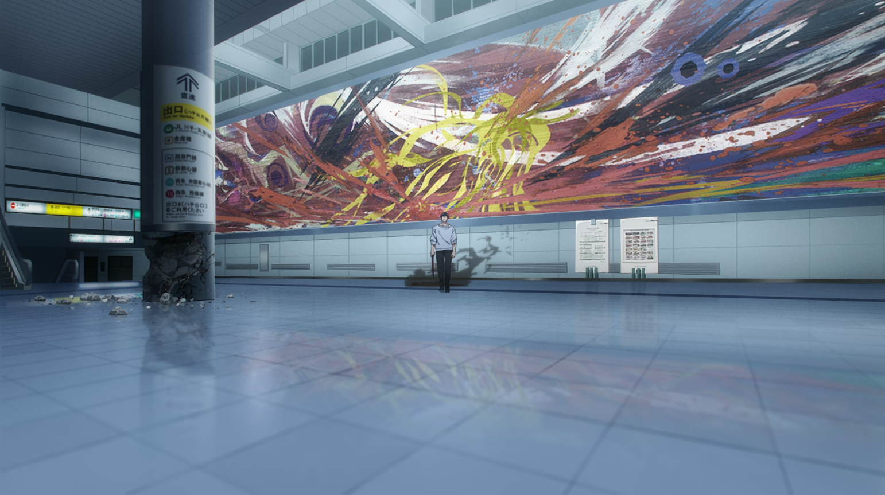
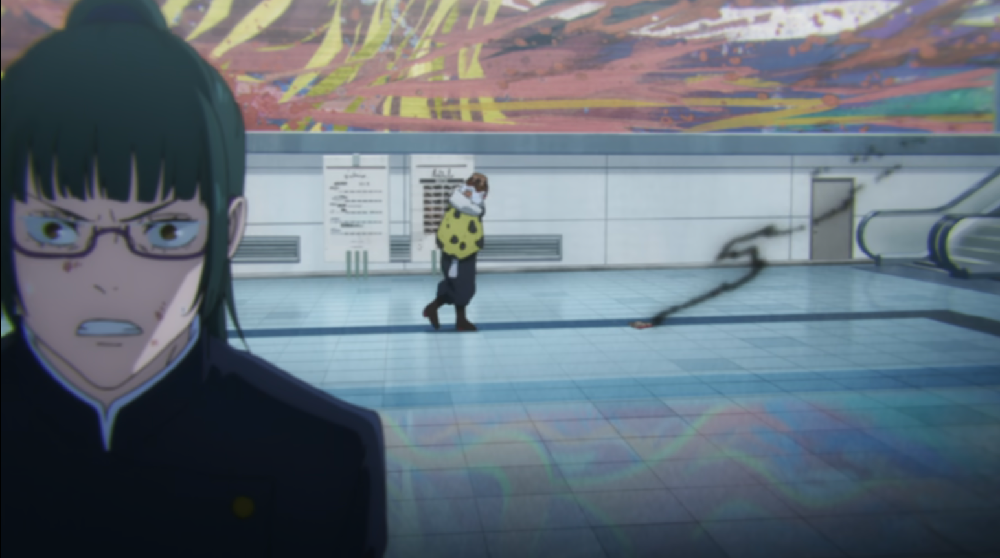
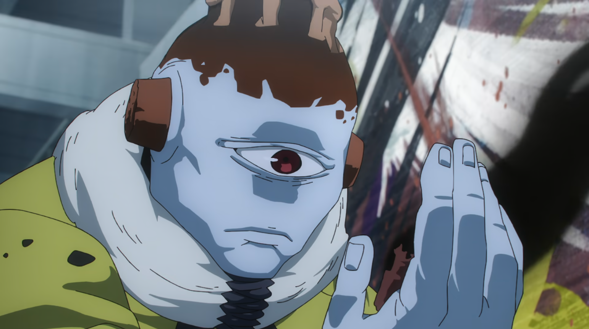

「逝ったか、陀昆……」  
「100年後の荒野で、また会おう。」

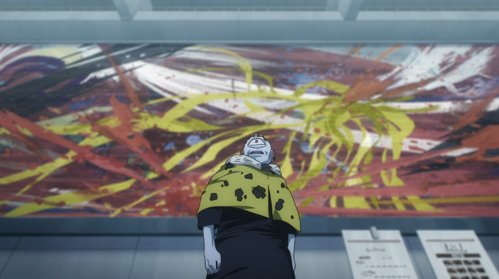

「さて・・・」

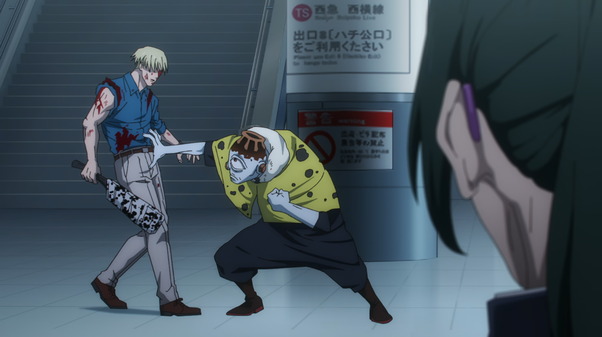

「一人目」

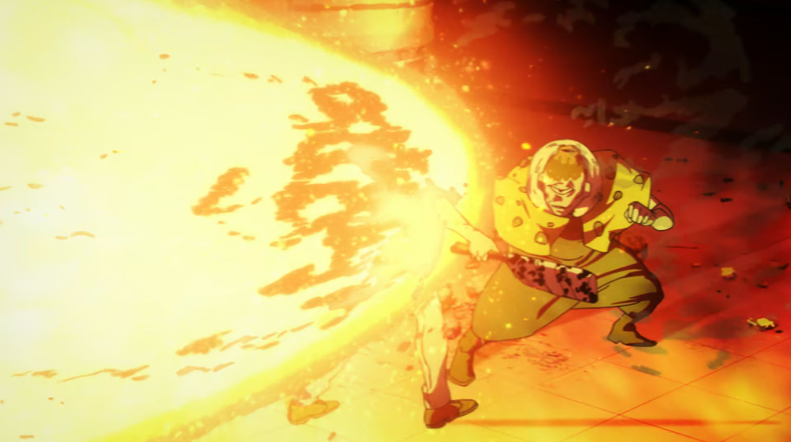
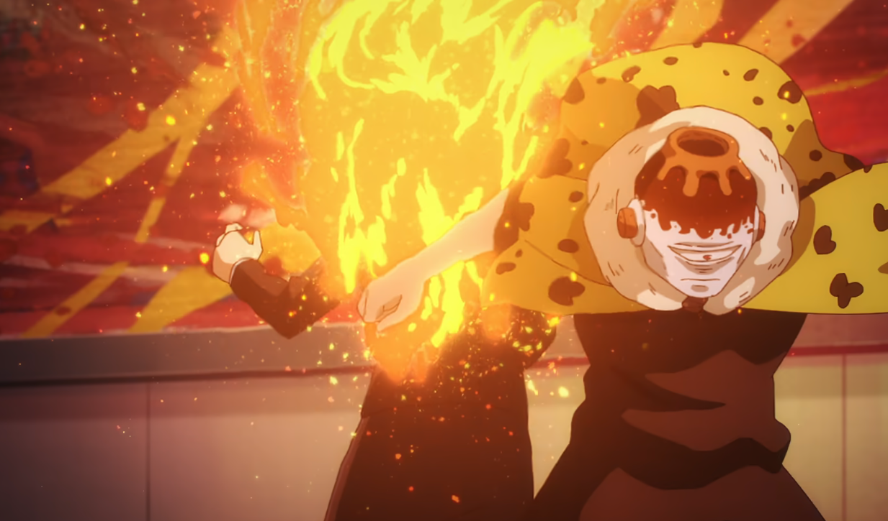

「二人目」

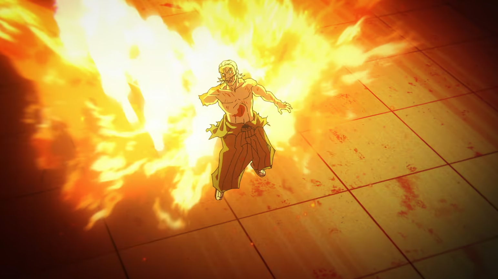
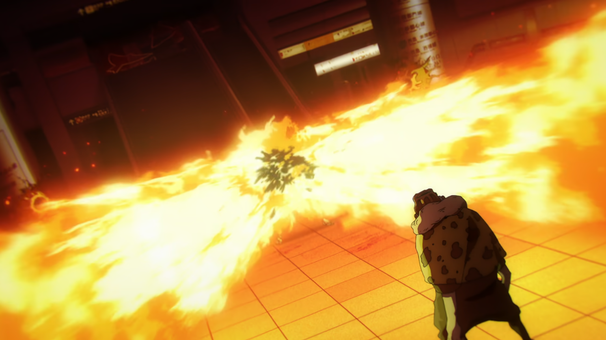
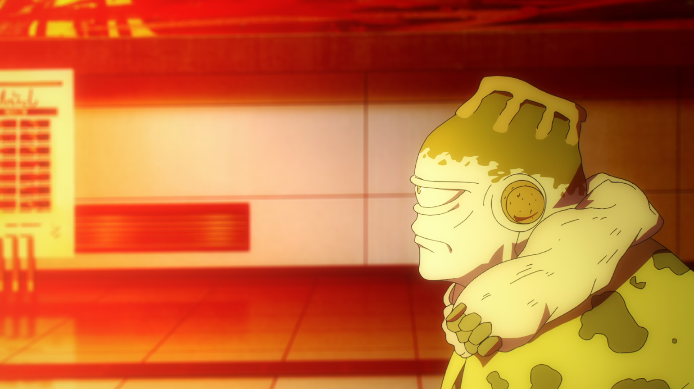

「三人目」

---

以降は アニメ39話“揺蕩-弐-” のシーンですが、同じ場所なのでこちらに記述。  

39話 10:49のマークシティ連絡通路は、同じ画角で撮影するにはエスカレーターを上りマークシティの2階に行く必要があります。

[▲TOPへ](../README.md#top)
