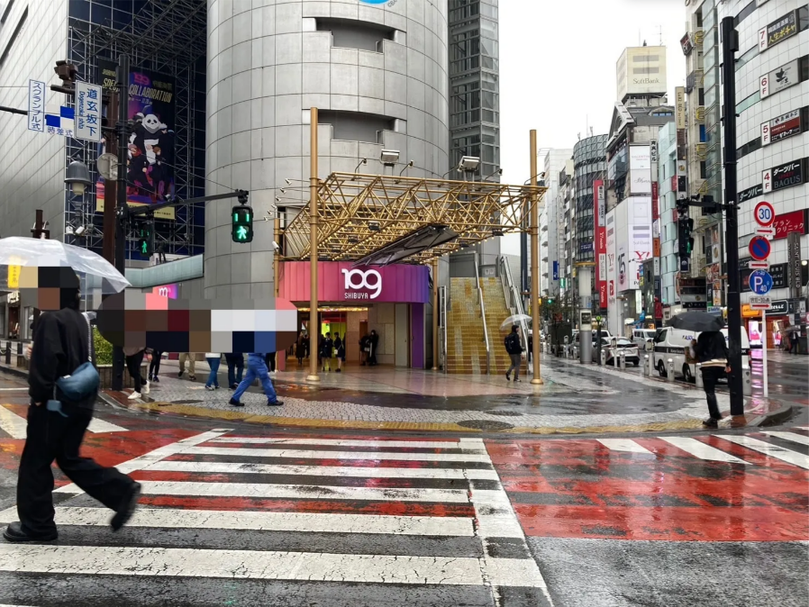
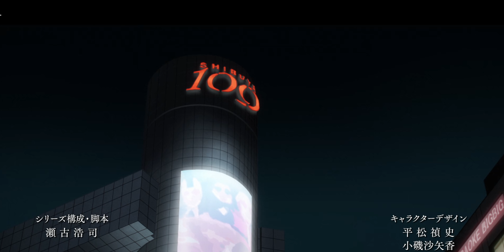
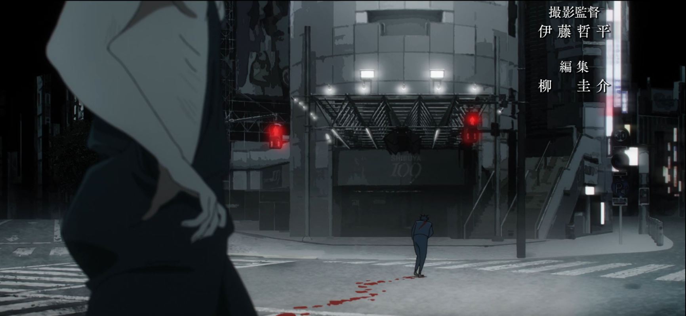
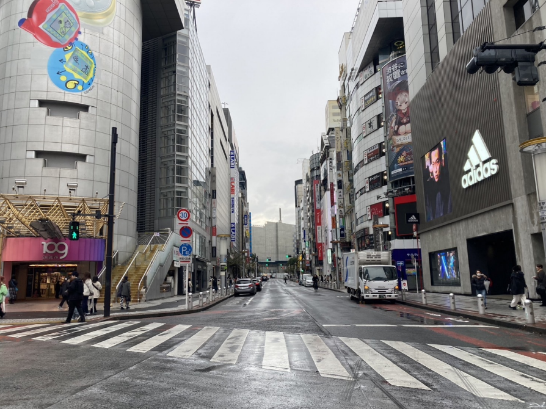
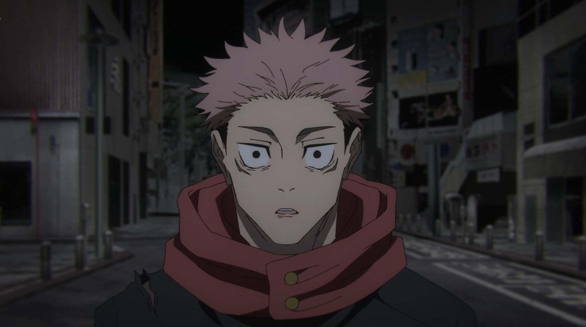
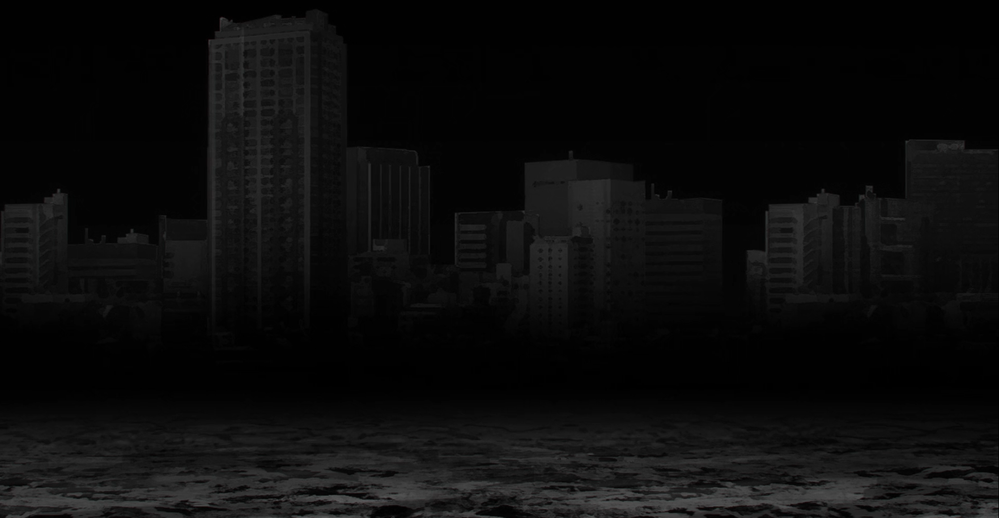
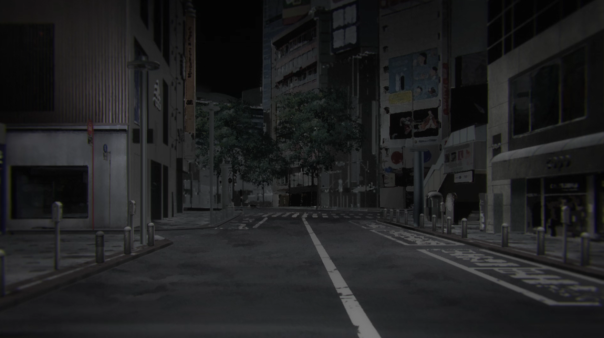
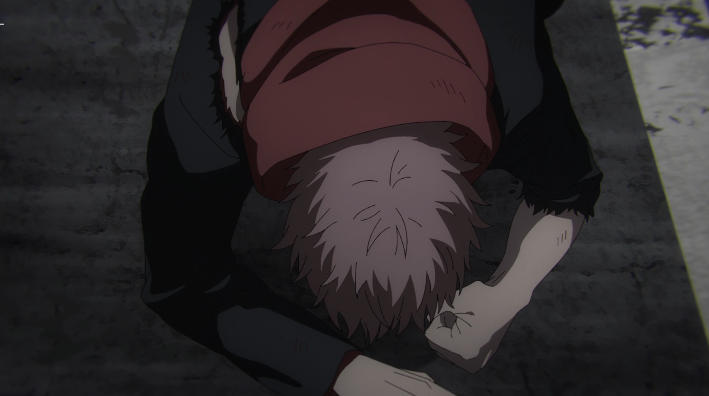
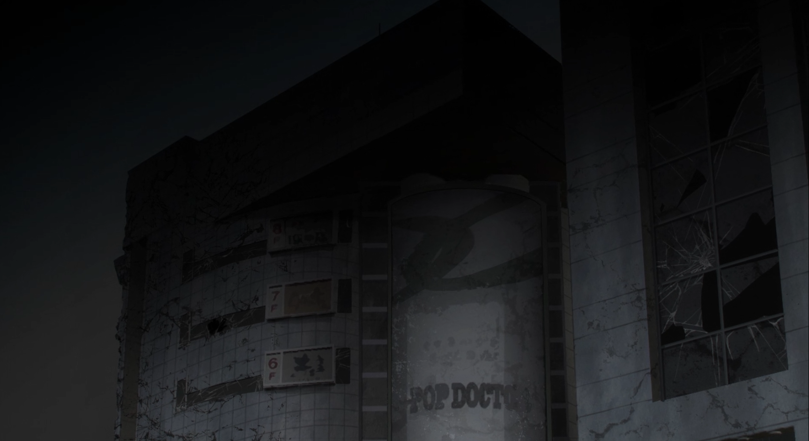
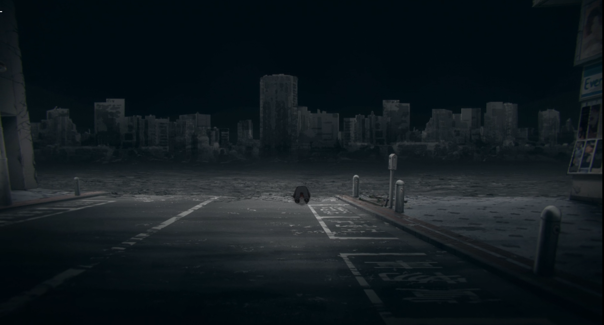

 [🏠](../README.md#top)

## アニメ41話聖地“霹靂-弐-”

### ㉜ 00:54 渋谷109前
重面からの不意打ち攻撃で瀕死の伏黒のシーン。

渋谷109の正面で、交差点内から撮影するとアニメっぽい距離間で撮影できます。

アニメはモノクロでしたが、現実世界で色がつくとまた印象が変わりますね。

45話の東堂・虎杖VS真人の戦いの聖地でもあります。

[▲TOPへ](../README.md#top)

### ㉝ 1:04 渋谷109前交差点
重面のシーン。

㉜と同じ渋谷109前のスクランブル交差点から、マツモトキヨシの方向(109に向かって右手)です！

03:15 「布瑠部 由良由良」

[▲TOPへ](../README.md#top)

### ㉞ 21:38 渋谷109前　道玄坂
アニメでは宿儺により全壊していますが、虎杖がいる場所はこの通り。

渋谷109に向かって右の道路です。

[▲TOPへ](../README.md#top)
