

 [🏠](../README.md#top)

## アニメ43話“理非-弐-”
3:21からの釘崎VS真人のシーンは、先述の㊹と同じ場所なので省略します。

写真は、[㊹](#shibuya44) と同じ通りにある壁の穴。3:29で野薔薇ちゃんが攻撃するときの場所です。

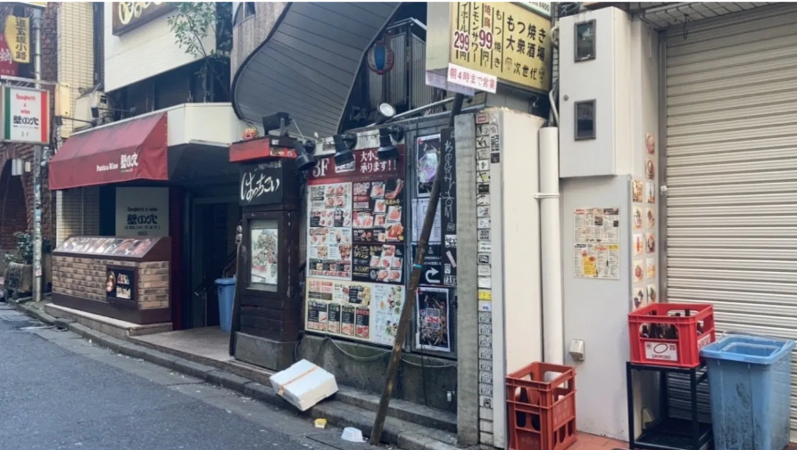

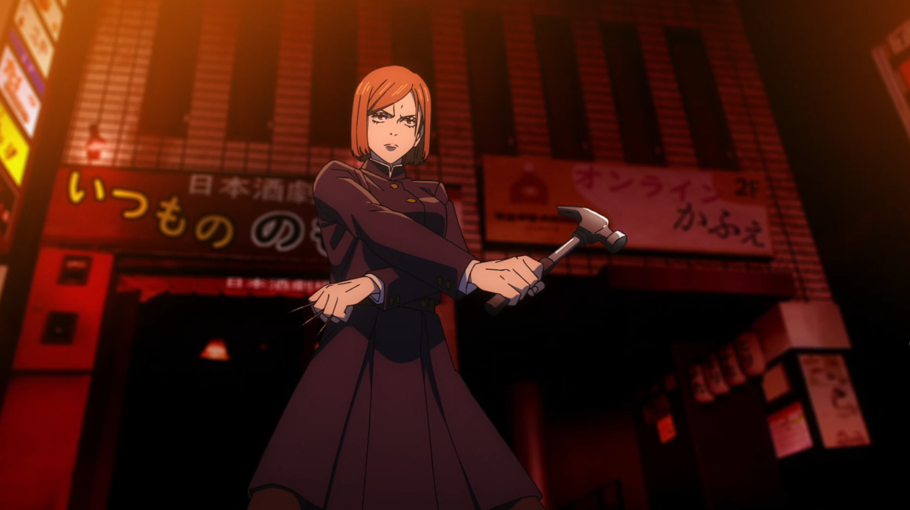
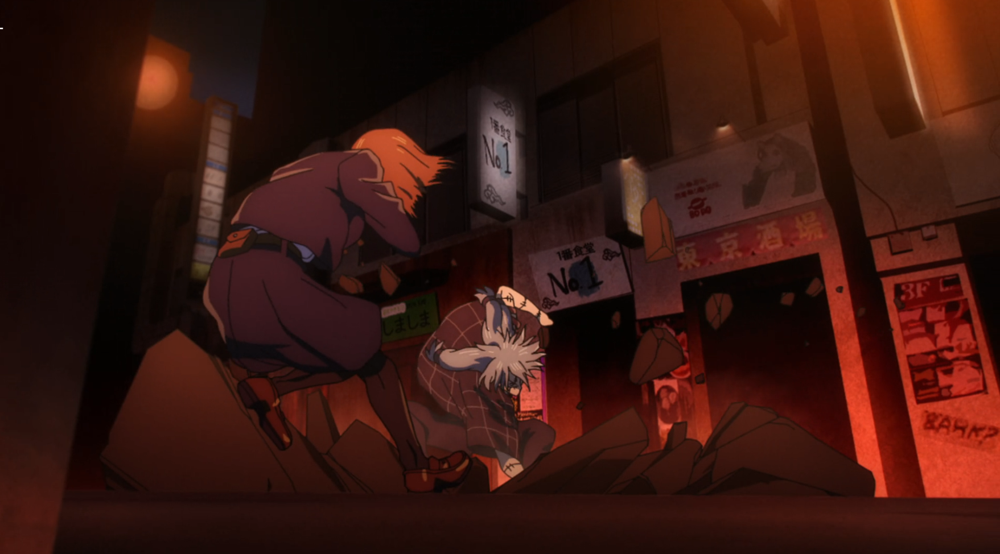
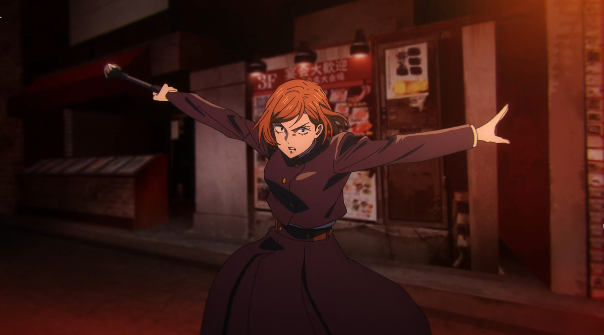
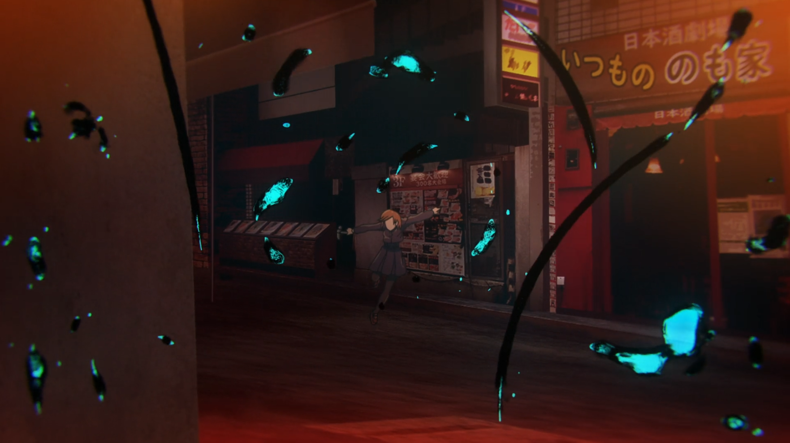

[▲TOPへ](../README.md#top)

### ㊺ 3:00 渋谷駅地下1階　渋谷ちかみち総合インフォメーション前
虎杖VS真人の戦闘シーン。

特徴的なカラーの柱なので、確認しやすいかと思います〇

駅内では、出口A0~3の方向を目指すとたどり着けるかと思います！

[▲TOPへ](../README.md#top)

### ㊻ 7:53 モスバーガ－渋谷道玄坂店前
真人が渋谷駅に向かって逃げるシーンです。

聖地 [㊹](#shibuya44) の道を道玄坂方向に歩くとすぐにたどり着けます◎

[▲TOPへ](../README.md#top)

### ㊼ 8:03 渋谷駅A０出口
先ほどのモスバーガーの角を曲がって道玄坂を109方向に歩くと見つかる渋谷駅A0出口。

アニメ内で、真人も釘崎も同じルートをたどっているので実際行ってみるとわくわくします✨

これ以降の43話分の聖地はA0出口から渋谷駅に入ったところになります。

[▲TOPへ](../README.md#top)

### ㊽ 8:27 A0出口内　UNIQLO前階段
先述の聖地㊼のA0出口を入ったところにある階段。

真人と、真人を追った釘崎が通過する階段です。

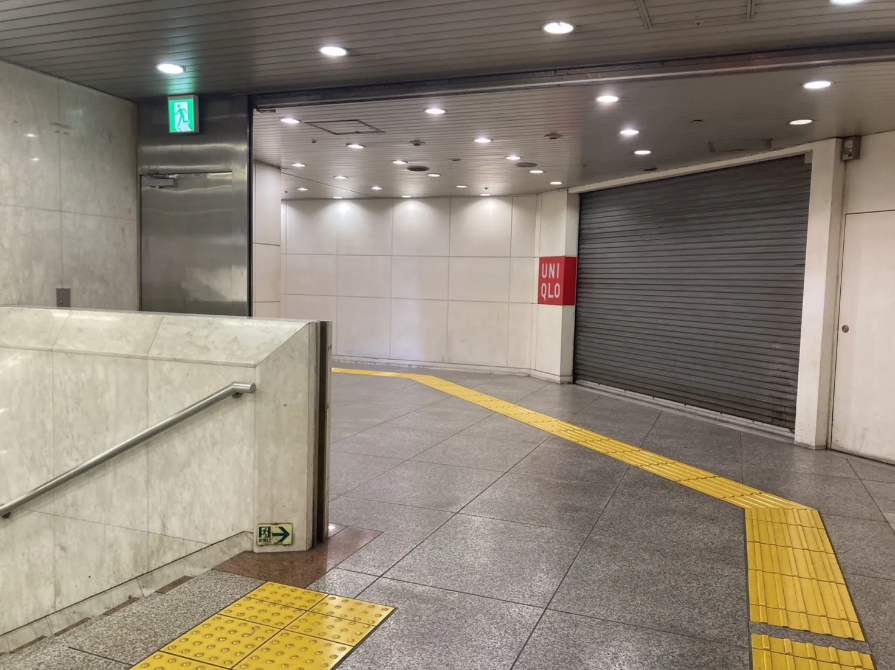

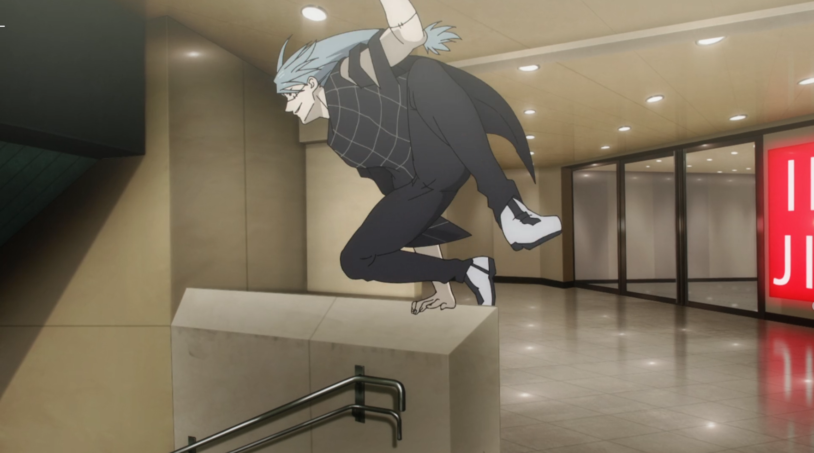

[▲TOPへ](../README.md#top)

### ㊾ 8:33 渋谷駅地下1階　A0出口方面通路
[㊽](#shibuya48) の聖地をさらに駅構内へと進んだ通路。

野薔薇ちゃんにとってカギとなる場所ですね、、。

照明も暗いし、閉鎖的な雰囲気を感じます。

[▲TOPへ](../README.md#top)

### ㊿ 21:41 渋谷駅地下1階　A0出口方面通路
上記 [㊾](#shibuya49) と場所自体は全く同じで、振り返ってみた景色です。

野薔薇ちゃんにとって大事なシーンなので分けてみました。

広告がある分アニメより彩色豊かな雰囲気になってはいますが、いやに広い空間がアニメと重なります。

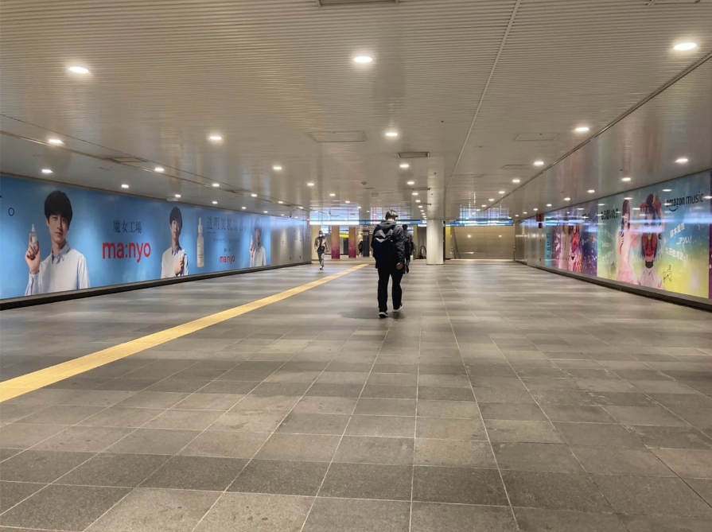

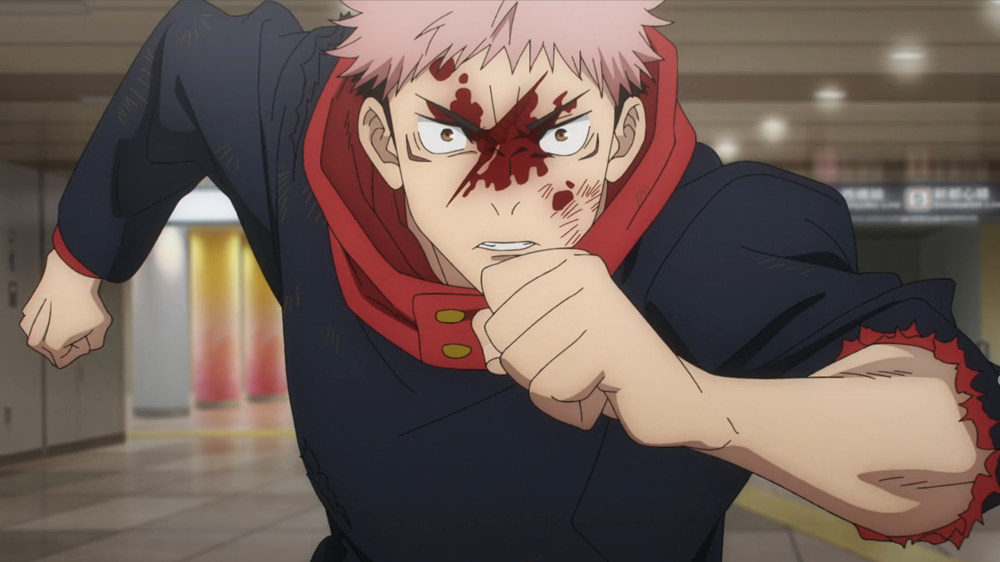
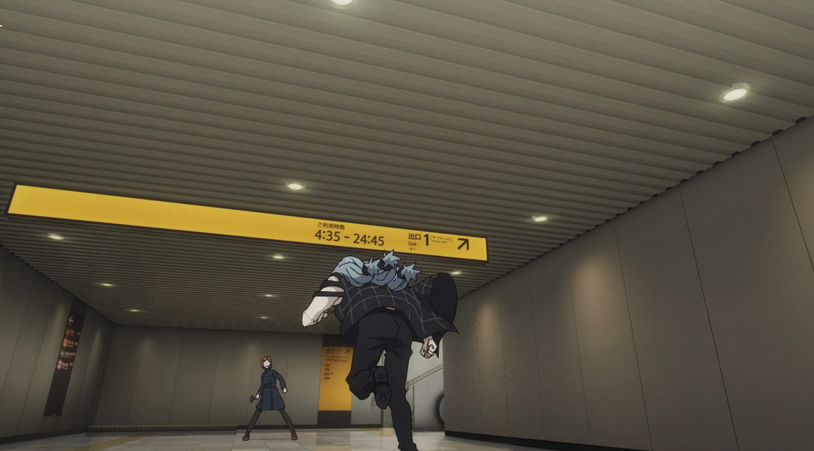
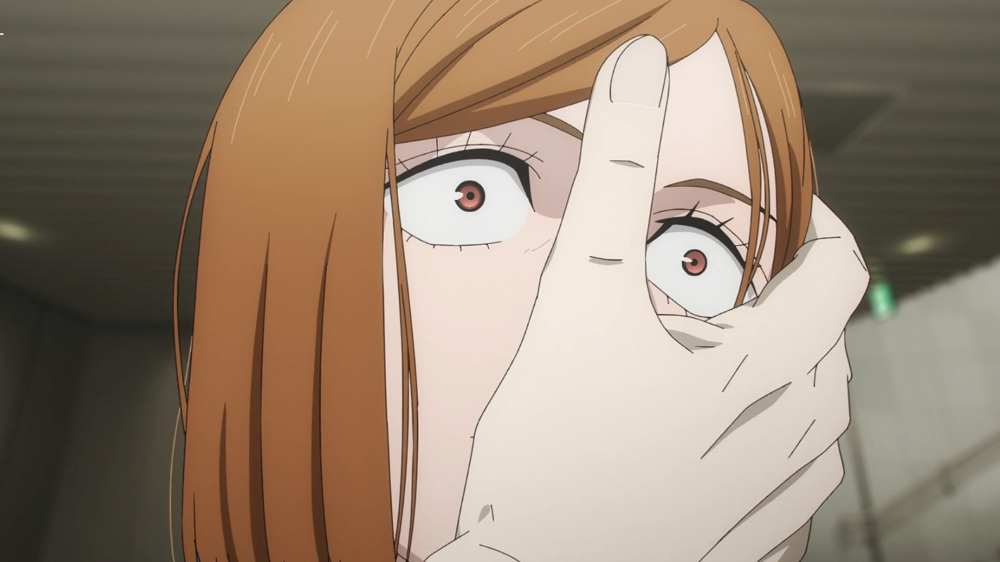
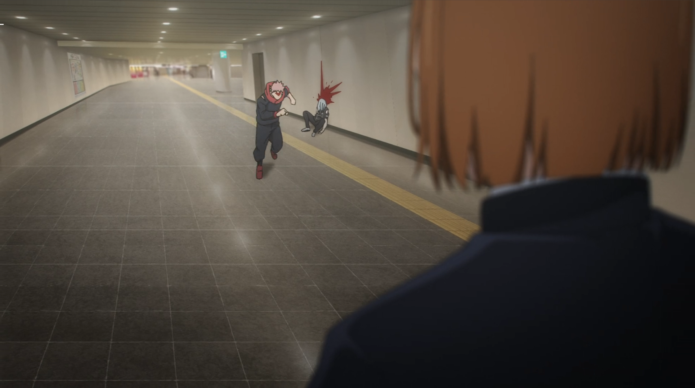
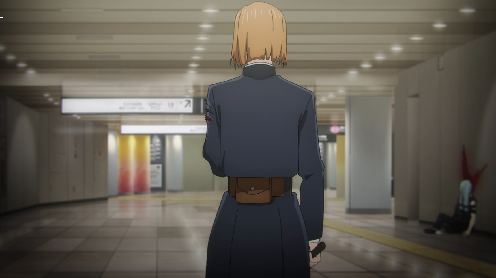
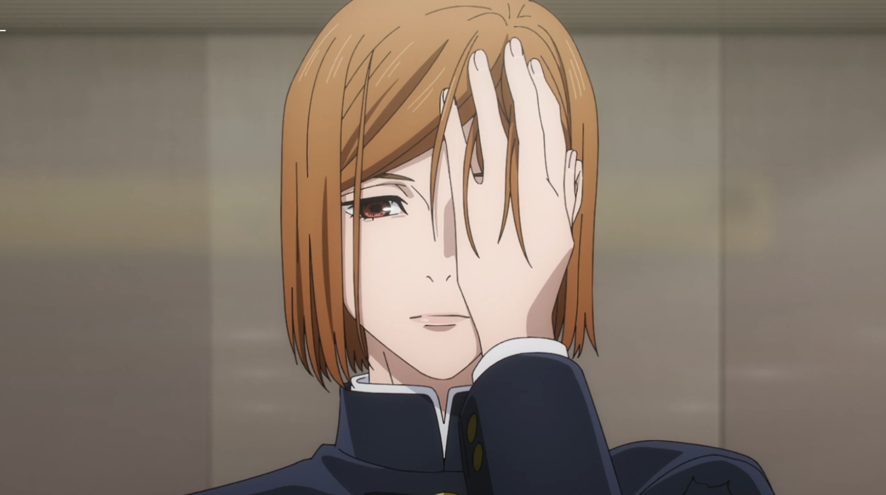
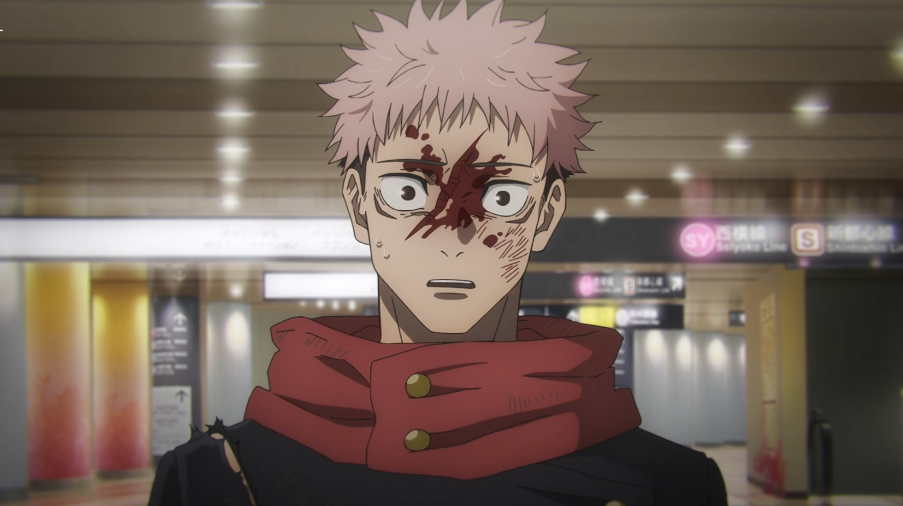
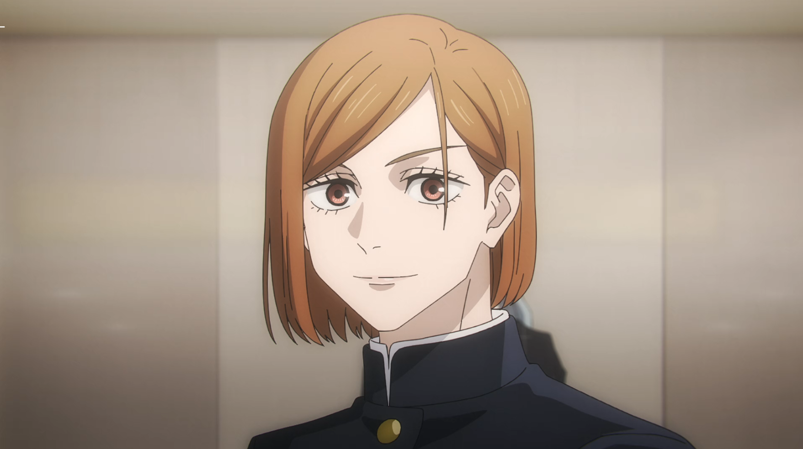
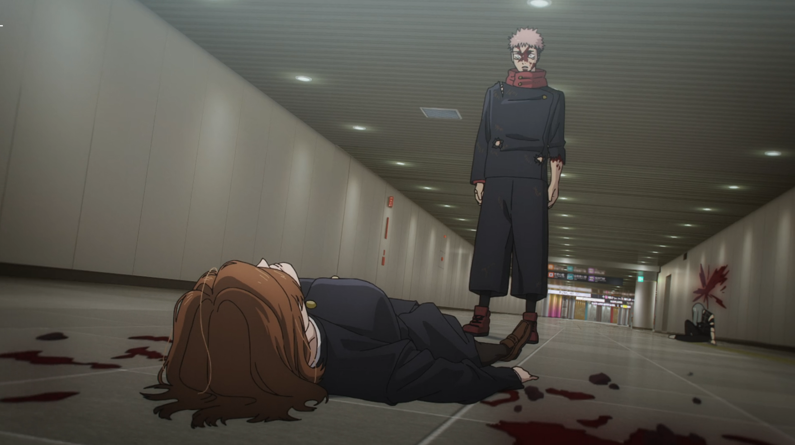

[▲TOPへ](../README.md#top)
