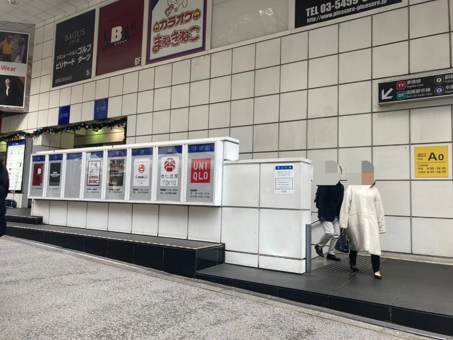
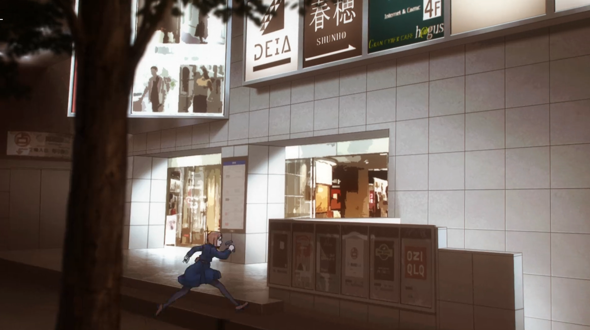

## アニメ43話“理非-弐-” [🏠](../README.md#top)

### ㊼ 8:03 渋谷駅A０出口
先ほどのモスバーガーの角を曲がって道玄坂を109方向に歩くと見つかる渋谷駅A0出口。

アニメ内で、真人も釘崎も同じルートをたどっているので実際行ってみるとわくわくします✨

これ以降の43話分の聖地はA0出口から渋谷駅に入ったところになります。

[▲TOPへ](../README.md#top)
